# 💹 Currency Exchange Rate Forecasting with Kolmogorov Filters & Moving Average

## 📌 Business Context
Accurate currency forecasting is a critical task for **finance departments, trading companies, and international businesses**.  
Exchange rate fluctuations impact:
- **Import/export costs**
- **Profit margins**
- **Investment strategies**
- **Pricing policies**

This project demonstrates how advanced **data-driven forecasting** can be applied to historical currency data to improve decision-making, reduce risk, and plan financial strategies.

---

## 🎯 Project Objective
To develop and compare three different approaches for predicting currency exchange rates:
1. **Kolmogorov Predictive Filter with Neural Network** – for capturing complex non-linear patterns.
2. **Moving Average Method** – for trend smoothing and short-term prediction.
3. **Alternative Kolmogorov Filter** – for interpretable non-neural forecasting.

---

## 📊 Data & Methodology
### **Data Sources**
- Historical currency exchange rate data (user-input, predefined, or Excel import).
- Flexible support for **custom datasets**.

### **Analytical Workflow**
1. **Data Collection & Cleaning** – handled missing values and outliers.
2. **Feature Engineering** – created time-series sequences for supervised learning.
3. **Model Implementation**:
   - Neural network with TensorFlow (Kolmogorov-based architecture).
   - Statistical moving average calculations.
   - Classical Kolmogorov filter without neural layers.
4. **Evaluation** – compared accuracy, stability, and prediction intervals.
5. **Visualization & Reporting** – clear charts and structured output tables.

---

## 📈 Key Insights
- **Neural-based Kolmogorov filter** provided better pattern recognition for volatile periods.
- **Moving Average** method performed best for stable currency trends but lagged during rapid changes.
- **Classical Kolmogorov filter** offered interpretable outputs suitable for quick decision-making in low-data scenarios.

---

## 📌 Business Value
- **Risk Reduction** – enables more accurate financial forecasting, minimizing exposure to currency volatility.
- **Scenario Planning** – helps businesses simulate “what-if” cases for future exchange rate changes.
- **Decision Support** – empowers finance teams with visual and tabular reports to guide pricing and investment.

---

## 🛠 Tools & Technologies
| Tool/Library     | Purpose |
|------------------|---------|
| Python 3.10+     | Core language |
| NumPy            | Numerical computations |
| TensorFlow       | Neural network implementation |
| Matplotlib       | Data visualization |
| PrettyTable      | Tabular reporting |
| OpenPyXL         | Excel data processing |

---

## 📊 Example Output
### Forecast Table (Kolmogorov NN)
| Step | Predicted Rate |
|------|---------------|
| 1    | 41.25         |
| 2    | 41.70         |
| 3    | 42.15         |

## 📸 Results & Visualizations

### **Variant #1 – Given Data**
*(Real exchange rates for next 2 days: 41.20, 41.40)*  
7 visualizations showing model performance on provided data.

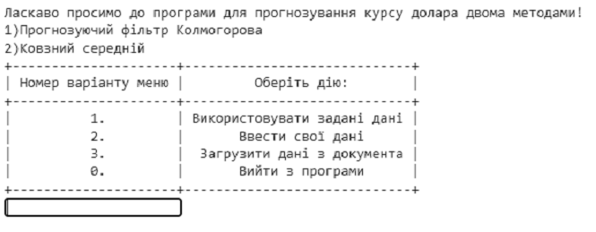  
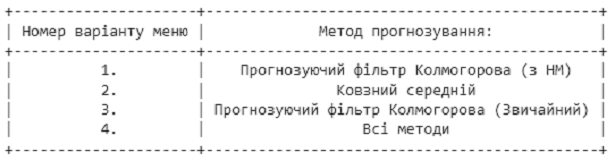  
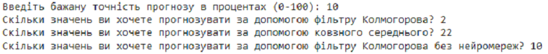  
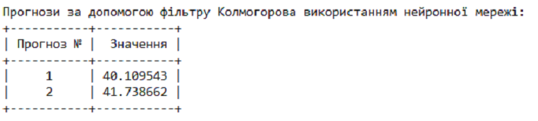  
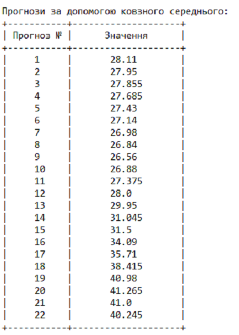  
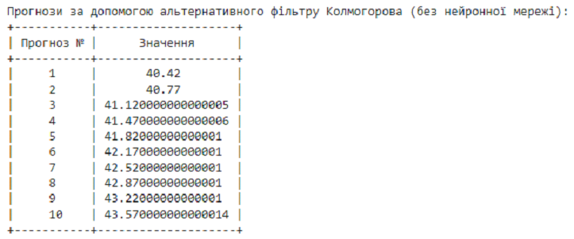  
  

---

### **Variant #2 – Custom Data**  
*(User-provided dataset)*  
3 visualizations showing adaptability to alternative data sources.

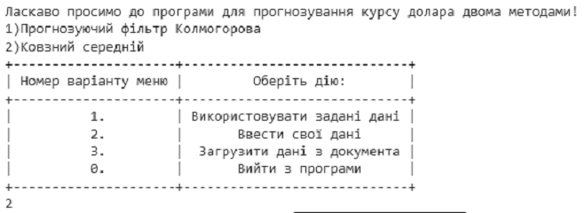  
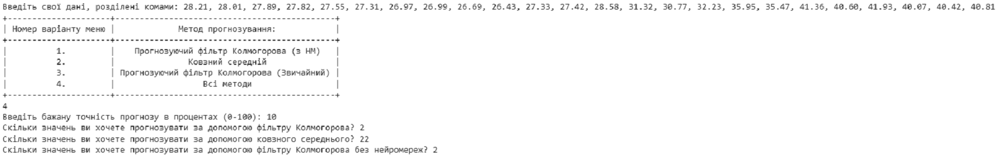  
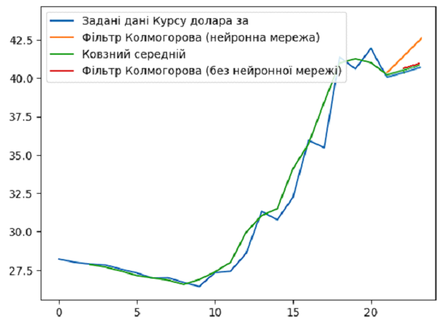  

---

### **Variant #3 – Load from Document**  
*(External dataset loaded from file)*  
5 visualizations showing performance on third-party data.

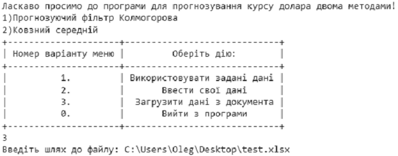  
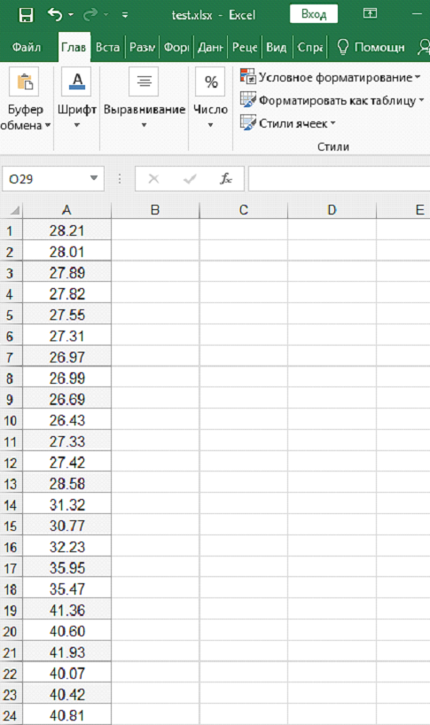  
  
  
  

---

Adding model explainability metrics for business transparency.
